# NYC Transportation Analytics Platform
# Documentation link on Notion
https://www.notion.so/Data-Warehouse-Project-21ab855b64fa8069af9fef0b2ebc1be4?source=copy_link
A comprehensive data engineering and analytics project analyzing NYC taxi and ride-sharing data.

## 🎯 Project Overview

This project builds a modern data warehouse analyzing 23+ million transportation records from NYC's official Taxi and Limousine Commission (TLC) data.

## 📊 Datasets
- **Yellow Taxi**: Traditional Manhattan taxi service (~3M records)
- **Green Taxi**: Outer borough taxi service (~1.2M records)  
- **For-Hire Vehicle**: Uber/Lyft ride-sharing data (~19.6M records)

## 🏗️ Architecture
- **Data Source**: NYC TLC official repository
- **Data Warehouse**: Snowflake Cloud
- **Transformation**: dbt (Data Build Tool)
- **Orchestration**: Snowflake Tasks

## 🚀 Quick Start

1. **Data Acquisition**:
   ```bash
   python src/data_acquisition/data_scrap.py
# 🚀 NYC Transportation Data Warehouse

## 📊 Star Schema ERD

```mermaid
erDiagram
    %% ================================================================
    %% NYC TRANSPORTATION DATA WAREHOUSE - STAR SCHEMA ERD
    %% ================================================================

    %% FACT TABLE (CENTER OF STAR SCHEMA)
    FACT_TAXI_TRIPS {
        string trip_key PK
        date pickup_date_key FK
        int pickup_location_key FK
        int dropoff_location_key FK
        string taxi_type_key FK
        timestamp pickup_datetime
        timestamp dropoff_datetime
        string vendor_id
        float passenger_count
        float trip_distance
        int trip_duration_minutes
        int payment_type
        float fare_amount
        float tip_amount
        float tolls_amount
        float total_amount
        float fare_per_mile
        float avg_speed_mph
        float tip_percentage
        int pickup_hour
        int pickup_day_of_week
        string pickup_borough
        string dropoff_borough
        string trip_geography_type
        string trip_purpose_category
        boolean is_efficient_trip
        boolean is_likely_satisfied_customer
        string trip_quality_score
        timestamp fact_created_at
    }

    %% DIMENSION TABLES
    DIM_DATE {
        date date_day PK
        int year
        int month
        int day
        int day_of_week
        int quarter
        string day_name
        string month_name
        string season
        boolean is_weekend
        boolean is_weekday
        boolean is_federal_holiday
        string federal_holiday
        string special_event
        boolean is_business_day
        string quarter_name
        string school_period
    }

    DIM_LOCATION {
        int location_id PK
        string borough
        string zone_name
        string district_type
        string zone_classification
        string urban_classification
        boolean is_tourism_area
        boolean is_high_traffic
        boolean is_airport
        string economic_tier
        string service_level
        string traffic_pattern
        string fare_tier
        int popularity_rank
        int borough_rank
        int total_trip_volume
        float avg_fare_overall
        string data_quality
        timestamp created_at
    }

    DIM_TAXI_TYPE {
        string taxi_type_id PK
        string taxi_type_name
        string description
        string regulation_type
        string booking_method
        string service_area
        string service_providers
        boolean is_traditional_taxi
        boolean is_ride_share
        boolean is_medallion_taxi
        string service_positioning
        string pricing_model
        int total_trips
        float avg_fare_amount
        float market_share_trips_pct
        float revenue_per_hour
        timestamp created_at
    }

    %% STAGING TABLES (DATA SOURCES)
    STG_YELLOW_TAXI {
        string trip_id PK
        int vendorid
        timestamp pickup_datetime
        timestamp dropoff_datetime
        int pickup_location_id
        int dropoff_location_id
        float passenger_count
        float trip_distance
        float fare_amount
        float total_amount
        string data_quality_flag
        boolean is_valid_trip
        string taxi_type
    }

    STG_GREEN_TAXI {
        string trip_id PK
        int vendorid
        timestamp pickup_datetime
        timestamp dropoff_datetime
        int pickup_location_id
        int dropoff_location_id
        float passenger_count
        float trip_distance
        float fare_amount
        float total_amount
        string data_quality_flag
        boolean is_valid_trip
        string taxi_type
    }

    STG_FHV {
        string trip_id PK
        string vendor_id
        timestamp pickup_datetime
        timestamp dropoff_datetime
        int pickup_location_id
        int dropoff_location_id
        float passenger_count
        float trip_distance
        float fare_amount
        float total_amount
        string service_provider
        string data_quality_flag
        boolean is_valid_trip
        string taxi_type
    }

    %% INTERMEDIATE TABLES
    INT_TAXI_TRIPS_CLEANED {
        string trip_id PK
        string taxi_type
        timestamp pickup_datetime
        timestamp dropoff_datetime
        int pickup_location_id
        int dropoff_location_id
        float trip_distance
        float fare_amount
        float total_amount
        string trip_category
        string fare_category
        string duration_category
        string time_period
        boolean is_valid_trip
    }

    INT_LOCATION_MAPPING {
        int location_id PK
        string borough
        string zone_name
        string district_type
        boolean is_tourism_area
        boolean is_high_traffic
        string economic_tier
        int pickup_count
        int dropoff_count
        int total_trip_volume
        string volume_category
    }

    %% RAW DATA SOURCES
    RAW_YELLOW_TAXI {
        int vendorid
        timestamp tpep_pickup_datetime
        timestamp tpep_dropoff_datetime
        int pulocationid
        int dolocationid
        float trip_distance
        float fare_amount
        float total_amount
        string source_file
    }

    RAW_GREEN_TAXI {
        int vendorid
        timestamp lpep_pickup_datetime
        timestamp lpep_dropoff_datetime
        int pulocationid
        int dolocationid
        float trip_distance
        float fare_amount
        float total_amount
        string source_file
    }

    RAW_FHV {
        string hvfhs_license_num
        timestamp pickup_datetime
        timestamp dropoff_datetime
        int pulocationid
        int dolocationid
        float trip_miles
        float base_passenger_fare
        string source_file
    }

    %% ANALYTICAL REPORTS
    RPT_DAILY_SUMMARY {
        date report_date
        string taxi_type_key
        int total_trips
        float total_revenue
        float avg_fare_amount
        float efficiency_rate_pct
        float satisfaction_rate_pct
        timestamp report_generated_at
    }

    RPT_LOCATION_ANALYSIS {
        int location_id
        string borough
        int pickup_trips
        int dropoff_trips
        string activity_pattern
        float efficiency_rate_pct
        int trip_volume_rank
        timestamp analysis_timestamp
    }

    RPT_DATA_QUALITY {
        string taxi_type
        int total_records
        float overall_quality_score
        string quality_grade
        string primary_recommendation
        timestamp analysis_timestamp
    }

    %% RELATIONSHIPS - STAR SCHEMA
    FACT_TAXI_TRIPS ||--o{ DIM_DATE : "pickup_date_key"
    FACT_TAXI_TRIPS ||--o{ DIM_LOCATION : "pickup_location_key"
    FACT_TAXI_TRIPS ||--o{ DIM_LOCATION : "dropoff_location_key"
    FACT_TAXI_TRIPS ||--o{ DIM_TAXI_TYPE : "taxi_type_key"

    %% DATA FLOW RELATIONSHIPS
    RAW_YELLOW_TAXI ||--o{ STG_YELLOW_TAXI : "transforms"
    RAW_GREEN_TAXI ||--o{ STG_GREEN_TAXI : "transforms"
    RAW_FHV ||--o{ STG_FHV : "transforms"

    STG_YELLOW_TAXI ||--o{ INT_TAXI_TRIPS_CLEANED : "combines"
    STG_GREEN_TAXI ||--o{ INT_TAXI_TRIPS_CLEANED : "combines"
    STG_FHV ||--o{ INT_TAXI_TRIPS_CLEANED : "combines"

    INT_TAXI_TRIPS_CLEANED ||--o{ INT_LOCATION_MAPPING : "enriches"

    INT_TAXI_TRIPS_CLEANED ||--o{ FACT_TAXI_TRIPS : "builds"
    INT_LOCATION_MAPPING ||--o{ DIM_LOCATION : "builds"

    %% ANALYTICAL RELATIONSHIPS
    FACT_TAXI_TRIPS ||--o{ RPT_DAILY_SUMMARY : "aggregates"
    FACT_TAXI_TRIPS ||--o{ RPT_LOCATION_ANALYSIS : "analyzes"
    STG_YELLOW_TAXI ||--o{ RPT_DATA_QUALITY : "validates"
    STG_GREEN_TAXI ||--o{ RPT_DATA_QUALITY : "validates"
    STG_FHV ||--o{ RPT_DATA_QUALITY : "validates"
```



## 🏗️ Architecture Overview

- **Fact Table**: `FACT_TAXI_TRIPS` (~50K records)
- **Dimensions**: Date, Location (NYC zones), Taxi Type
- **Technology**: dbt + Snowflake
- **Update Frequency**: Daily

## 📈 Key Metrics

- Trip volume and revenue analysis
- Geographic demand patterns  
- Service type performance
- Data quality monitoring (A/B grade)

  erDiagram
    %% ================================================================
    %% SIMPLIFIED STAR SCHEMA - CORE DATA WAREHOUSE
    %% ================================================================


